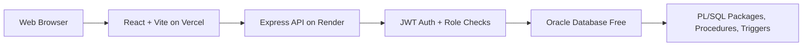
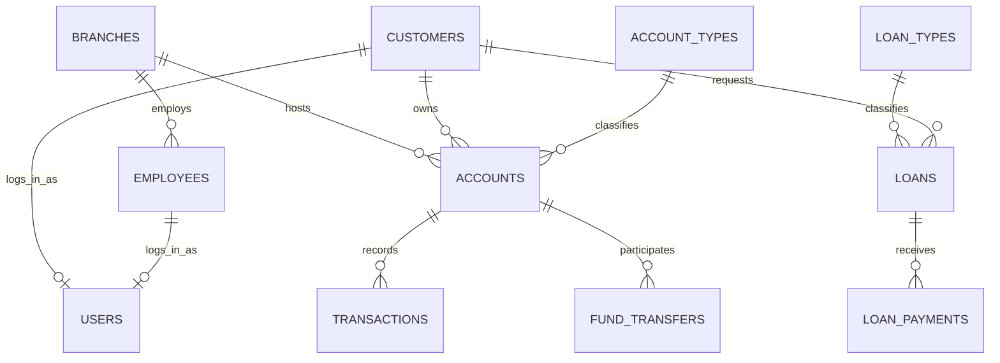

# Smart Banking Management System

An academic, production-like Banking Management System built with React, Express.js, and Oracle Database Free in Oracle Cloud. The project keeps Oracle SQL and PL/SQL at the center of the system, including tables, constraints, indexes, views, packages, procedures, triggers, audit logs, and transactional banking operations.

## Features

- Four roles: Admin, Manager, Employee, Customer.
- Customer registration and secure login through Oracle-backed API endpoints.
- Password hashing with Node.js `crypto.scrypt`.
- JWT authentication for protected API routes.
- Backend role and branch/customer scope checks.
- Admin/Manager staff User Management with lock/unlock, activation, reset, and audit actions.
- Read-only allowlisted Database Explorer with server-side pagination, CSV export, and Manager branch scope.
- Role-specific dashboards for Admin, Manager, Employee, and Customer.
- Package-controlled deposit/withdrawal reversal with an auditable compensating ledger row.
- Ownership-scoped bank statements, saved beneficiaries, customer KYC workflow, and practical settings.
- Educational deposit schemes with simple/monthly-compound profit, tax, maturity, DPS, printable quotations, reminders, and preview-only early withdrawal estimates.
- Customer, employee, branch, account, loan, transaction, report, audit, and settings screens.
- Open account, deposit, withdraw, transfer, freeze account, activate account, loan application, approval, rejection, and payment workflows.
- Oracle audit logging through database triggers.
- Beginner-friendly setup and deployment documentation.

## Technology

- Frontend: React, Vite, Tailwind CSS, Axios, Lucide React.
- Backend: Node.js, Express.js, Oracle `oracledb`.
- Database: Oracle Database Free in Oracle Cloud.
- Deployment: Vercel for frontend, Render for backend.

## Architecture



## Folder Structure

```text
client/      React frontend
server/      Express backend and Oracle connection
database/    Oracle SQL, PL/SQL, tests, and schema installer
docs/        Beginner setup, deployment, API, and workflow guides
```

## Local Windows setup

Install Git, Node.js 20 or newer, npm, and an accessible Oracle Database Free/Autonomous Database. From PowerShell:

```powershell
git clone <repository-url>
Set-Location Banking_DBMS_Project
npm install
npm --prefix client install
npm --prefix server install
Copy-Item server\.env.example server\.env
```

Edit `server/.env` locally. `PORT` is the API port, `CLIENT_ORIGIN` is the browser origin, `DB_USER`, `DB_PASSWORD`, and `DB_CONNECT_STRING` identify the Oracle application schema, `DB_POOL_MIN/MAX` tune the pool, and `SESSION_SECRET` must be at least 32 random characters. If Autonomous Database mTLS is required, set the optional wallet directory/password variables and keep the wallet outside Git. Never paste these values into source files.

The Vite development proxy sends `/api` to `http://localhost:5000`, so `client/.env.local` is normally unnecessary. For a separately hosted frontend, create `client/.env.local` with `VITE_API_URL=https://your-api-host.example/api`.

Test configuration and start the two processes in separate PowerShell windows:

```powershell
npm run db:test
npm run db:doctor
npm run server:start
npm run client:dev
```

Open `http://localhost:5173/login`; verify the backend at `http://localhost:5000/api/health`.

## Oracle setup and repair

Use a dedicated classroom schema. After confirming the schema is empty or safe to initialize, connect as the application user and run `@database/run_all.sql`. This installer does not run the destructive `database/sql/00_drop_objects.sql`. Then inspect invalid objects and errors:

```sql
SELECT object_type, status, COUNT(*)
FROM user_objects
GROUP BY object_type, status
ORDER BY object_type, status;

SELECT name, type, line, position, text
FROM user_errors
ORDER BY name, sequence;
```

For an existing schema, run the non-destructive Phase 1 upgrade `@database/migrations/001_staff_users_explorer_dashboard.sql` (or paste `database/worksheet/phase1_upgrade.sql`), then run the read-only checks with `@database/tests/phase1_tests.sql`. Only after the objects are valid, run `@database/tests/acceptance_tests.sql` and require `FAILED : 0` / `FINAL RESULT: PASS`. Seed university demonstration identities with `npm --prefix server run seed:viva-users -- --base-secret "<local-secret-at-least-16-chars>"` (add `--include-customer` for the optional customer). Temporary passwords are printed only to the invoking terminal and require first-login change. Remove or deactivate them after testing. See `docs/ORACLE_DATABASE_FREE_SETUP.md` for wallet, service-name, and invalid-object troubleshooting.

For Phase 2 on an existing schema, run `@database/migrations/002_reversal_statement_customer_tools.sql` (or paste `database/worksheet/phase2_upgrade.sql`), then `@database/tests/phase2_tests.sql`. Reversal is intentionally limited to successful `DEPOSIT` and `WITHDRAWAL` rows; transfers and loan payments are unsupported.

For Phase 3 on an existing schema, run the non-destructive `@database/migrations/003_deposit_profit_suite.sql`, then the read-only `@database/tests/phase3_tests.sql`. The pasteable `database/worksheet/full_upgrade.sql` contains the Phase 1–3 upgrade without `@` dependencies. For an empty classroom schema use `database/worksheet/full_fresh_install.sql`; `full_reset_and_install.sql` is destructive and development-only. `database/worksheet/verify_install.sql` is read-only. Deposit quotations never activate a deposit, debit an account, or post a ledger transaction. The calculator is an educational estimate; tax and early-withdrawal values are not banking advice.

## Deployment

- Deploy `client` to Vercel with `VITE_API_URL=https://your-render-service.onrender.com/api`.
- Deploy `server` to Render with Oracle environment variables.
- Keep all credentials in environment variables.
- Do not install Oracle locally for demonstration.

See `docs/VERCEL_DEPLOYMENT.md` and `docs/RENDER_DEPLOYMENT.md`.

## Testing

```bash
npm run client:lint
npm run client:build
npm run server:check
npm run server:test
```

Database acceptance tests:

```sql
@database/tests/acceptance_tests.sql
```

Common fixes: free ports 5000/5173 before restarting; check every required `.env` variable without printing its value; verify the Oracle service name and database availability; keep `CLIENT_ORIGIN` aligned with the browser origin; use `VITE_API_URL` only when the frontend is not using the Vite proxy; reinstall dependencies with the existing lock files if packages are mismatched; and clear an expired `bank_token`/`bank_user` session by signing out or using a private browser window.

## ER Diagram



## Relational Schema

- `branches(branch_id, branch_code, branch_name, city, address, phone, swift_code, status, created_at)`
- `customers(customer_id, first_name, last_name, date_of_birth, phone, email, national_id, address, status)`
- `employees(employee_id, branch_id, employee_code, job_title, email, salary, status)`
- `users(user_id, customer_id, employee_id, staff_code, username, password_hash, role, is_active, must_change_password, account_locked, last_login)`
- `login_history(login_history_id, user_id, attempted_username, success_flag, event_type, failure_reason, occurred_at)`
- `transaction_reversals(reversal_id, original_transaction_id, reversal_transaction_id, reason, reversed_by, reversed_at, status)`
- `beneficiaries(beneficiary_id, customer_id, source_account_id, beneficiary_account_id, nickname, status)`
- `customer_kyc(kyc_id, customer_id, document_type, document_reference, status, reviewed_by, reviewed_at)`
- `user_preferences(user_id, theme, rows_per_page, currency_display, notifications_enabled)`
- `accounts(account_id, account_number, customer_id, branch_id, account_type_id, balance, status)`
- `loans(loan_id, loan_number, customer_id, loan_type_id, requested_amount, status)`
- `transactions(transaction_id, account_id, transaction_type, amount, reference_no, processed_by)`
- `audit_log(audit_id, table_name, record_id, action_name, action_by, action_date)`
- `deposit_schemes(scheme_id, scheme_code, scheme_type, annual_profit_rate, calculation_method, tax_percentage, status)`
- `deposit_certificates(certificate_id, certificate_number, customer_id, scheme_id, expected_maturity_amount, maturity_date, status)`
- `loan_types(loan_type_id, type_name, descriptions, income/fee eligibility, interest_method, amount and term limits, status)`

## Normalization

- First Normal Form: atomic columns and no repeating groups.
- Second Normal Form: non-key values depend on full primary keys.
- Third Normal Form: lookup data such as account types, loan types, and branches are separated from transaction tables.
- Referential integrity is enforced with foreign keys and role/principal constraints.

## Project Workflow

1. Browser loads React from Vercel.
2. React sends API calls to Express on Render.
3. Express validates JWT and role permissions.
4. Express calls Oracle SQL or PL/SQL.
5. Oracle enforces constraints, triggers, and transaction rules.
6. React renders tables, forms, receipts, reports, and dashboard statistics.

## Future Scope

- Password reset through email.
- Two-factor authentication.
- Export reports as PDF.
- More detailed teller cash drawer workflow.
- Rate limiting and production monitoring.

## Viva Questions

- Why did the project keep Oracle instead of PostgreSQL?
- What is the difference between authentication and authorization?
- Why should role checks happen on the backend?
- How does JWT protect API requests?
- Why are passwords hashed instead of encrypted?
- How do Oracle triggers support audit logging?
- Why are transactions important for transfer operations?
- What does normalization improve in this schema?
- How can Oracle Database Free be used without local installation?
- How do Vercel, Render, and Oracle Cloud work together?
