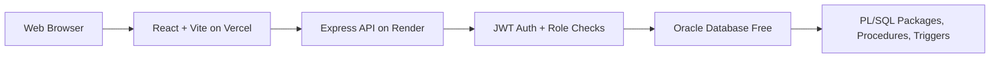
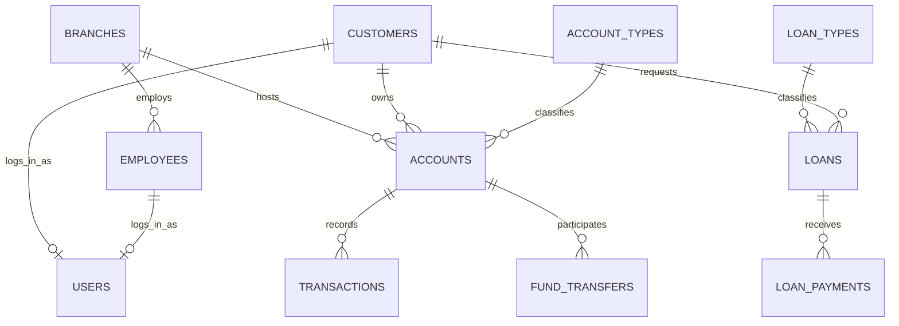

# Smart Banking Management System

An academic, production-like Banking Management System built with React, Express.js, and Oracle Database Free in Oracle Cloud. The project keeps Oracle SQL and PL/SQL at the center of the system, including tables, constraints, indexes, views, packages, procedures, triggers, audit logs, and transactional banking operations.

## Features

- Four roles: Admin, Manager, Employee, Customer.
- Customer registration and secure login through Oracle-backed API endpoints.
- Password hashing with Node.js `crypto.scrypt`.
- JWT authentication for protected API routes.
- Backend role and branch/customer scope checks.
- Customer, employee, branch, account, loan, transaction, report, audit, and settings screens.
- Open account, deposit, withdraw, transfer, freeze account, activate account, loan application, approval, rejection, and payment workflows.
- Oracle audit logging through database triggers.
- Beginner-friendly setup and deployment documentation.

## Technology

- Frontend: React, Vite, Tailwind CSS, Axios, Lucide React.
- Backend: Node.js, Express.js, Oracle `oracledb`.
- Database: Oracle Database Free in Oracle Cloud.
- Deployment: Vercel for frontend, Render for backend.

## Architecture



## Folder Structure

```text
client/      React frontend
server/      Express backend and Oracle connection
database/    Oracle SQL, PL/SQL, tests, and schema installer
docs/        Beginner setup, deployment, API, and workflow guides
```

## Installation

```bash
npm install
npm --prefix client install
npm --prefix server install
```

Configure `server/.env` from `server/.env.example`, then run:

```bash
npm --prefix server start
npm --prefix client run dev
```

## Oracle Setup

Use Oracle Database Free in Oracle Cloud. Create an application database user such as `BANK_APP`, grant the required Oracle privileges, then run:

```sql
@database/run_all.sql
```

Create demo users after sample data is installed:

```bash
npm --prefix server run seed:demo-users -- ClassroomPass123
```

See `docs/ORACLE_DATABASE_FREE_SETUP.md` for the full cloud guide.

## Deployment

- Deploy `client` to Vercel with `VITE_API_URL=https://your-render-service.onrender.com/api`.
- Deploy `server` to Render with Oracle environment variables.
- Keep all credentials in environment variables.
- Do not install Oracle locally for demonstration.

See `docs/VERCEL_DEPLOYMENT.md` and `docs/RENDER_DEPLOYMENT.md`.

## Screenshots Placeholder

- `[Screenshot: animated login/signup screen]`
- `[Screenshot: admin dashboard]`
- `[Screenshot: account management table]`
- `[Screenshot: transaction receipt]`
- `[Screenshot: loan approval workflow]`
- `[Screenshot: audit log]`

## Testing

```bash
npm run client:lint
npm run client:build
npm run server:check
npm run server:test
```

Database acceptance tests:

```sql
@database/tests/acceptance_tests.sql
```

## ER Diagram



## Relational Schema

- `branches(branch_id, branch_code, branch_name, city, address, phone, swift_code, status, created_at)`
- `customers(customer_id, first_name, last_name, date_of_birth, phone, email, national_id, address, status)`
- `employees(employee_id, branch_id, employee_code, job_title, email, salary, status)`
- `users(user_id, customer_id, employee_id, username, password_hash, role, is_active, last_login)`
- `accounts(account_id, account_number, customer_id, branch_id, account_type_id, balance, status)`
- `loans(loan_id, loan_number, customer_id, loan_type_id, requested_amount, status)`
- `transactions(transaction_id, account_id, transaction_type, amount, reference_no, processed_by)`
- `audit_log(audit_id, table_name, record_id, action_name, action_by, action_date)`

## Normalization

- First Normal Form: atomic columns and no repeating groups.
- Second Normal Form: non-key values depend on full primary keys.
- Third Normal Form: lookup data such as account types, loan types, and branches are separated from transaction tables.
- Referential integrity is enforced with foreign keys and role/principal constraints.

## Project Workflow

1. Browser loads React from Vercel.
2. React sends API calls to Express on Render.
3. Express validates JWT and role permissions.
4. Express calls Oracle SQL or PL/SQL.
5. Oracle enforces constraints, triggers, and transaction rules.
6. React renders tables, forms, receipts, reports, and dashboard statistics.

## Future Scope

- Password reset through email.
- Two-factor authentication.
- Export reports as PDF.
- More detailed teller cash drawer workflow.
- Admin UI for creating staff login users.
- Rate limiting and production monitoring.

## Viva Questions

- Why did the project keep Oracle instead of PostgreSQL?
- What is the difference between authentication and authorization?
- Why should role checks happen on the backend?
- How does JWT protect API requests?
- Why are passwords hashed instead of encrypted?
- How do Oracle triggers support audit logging?
- Why are transactions important for transfer operations?
- What does normalization improve in this schema?
- How can Oracle Database Free be used without local installation?
- How do Vercel, Render, and Oracle Cloud work together?
