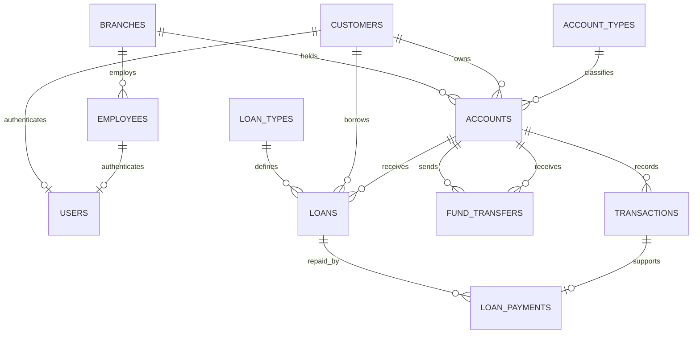

# ER Diagram

```mermaid
erDiagram
  BRANCHES ||--o{ EMPLOYEES : employs
  BRANCHES ||--o{ ACCOUNTS : holds
  CUSTOMERS ||--o{ ACCOUNTS : owns
  ACCOUNT_TYPES ||--o{ ACCOUNTS : classifies
  CUSTOMERS ||--o| USERS : authenticates
  EMPLOYEES ||--o| USERS : authenticates
  ACCOUNTS ||--o{ TRANSACTIONS : records
  ACCOUNTS ||--o{ FUND_TRANSFERS : sends
  ACCOUNTS ||--o{ FUND_TRANSFERS : receives
  LOAN_TYPES ||--o{ LOANS : defines
  CUSTOMERS ||--o{ LOANS : borrows
  ACCOUNTS ||--o{ LOANS : receives
  LOANS ||--o{ LOAN_PAYMENTS : repaid_by
  TRANSACTIONS ||--o| LOAN_PAYMENTS : supports
```

`AUDIT_LOG` records cross-cutting entity changes. `FUND_TRANSFERS` resolves the semantic relationship between two accounts and links the paired debit/credit transactions.
